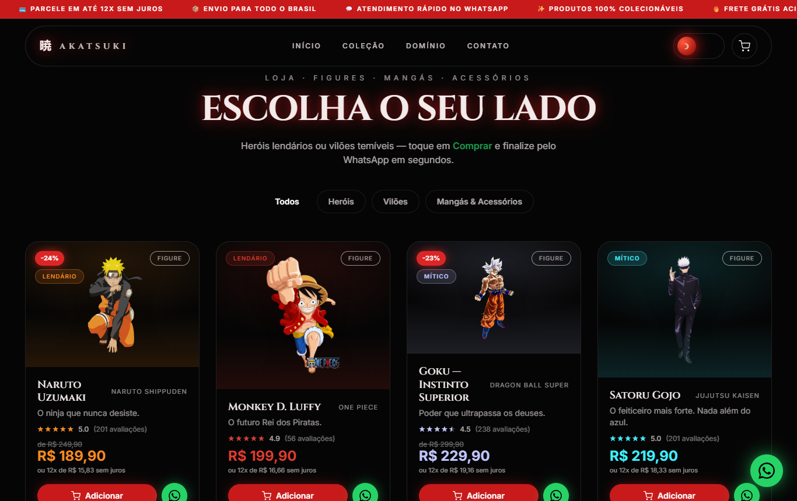

# 暁 AKATSUKI — Loja de Animes

Loja de animes cinematográfica em 3D — **action figures, mangás e colecionáveis** de heróis e vilões dos maiores animes, com checkout direto pelo **WhatsApp**. Visual com lua vermelha, partículas, dois temas (Akatsuki / Expansão de Domínio) e **aura de energia por personagem** ao adicionar ao carrinho.



> Projeto Next.js. Vendas via WhatsApp **(33) 99877-9375**.

---

## ✨ Funcionalidades

- **Catálogo de produtos** — 24 figures (17 heróis + 7 vilões), mangás (com capas oficiais), miniaturas e acessórios.
- **Carrinho** — adicione vários itens e finalize tudo numa **única mensagem de WhatsApp**; persiste no `localStorage`. Ao adicionar, o card dispara a aura do personagem e o carrinho abre mostrando o item.
- **Compra direta** — botão de WhatsApp em cada card com mensagem pré-preenchida (produto + preço).
- **Filtros** — Todos / Heróis / Vilões / Mangás & Acessórios.
- **Cara de e-commerce** — barra de promoções, faixa de benefícios, badge de desconto, avaliações (estrelas), parcelamento em 12x e tag de frete grátis.
- **Dois temas cinematográficos** — 🌑 *Akatsuki* (escuro, lua vermelha) ⇄ ☀️ *Expansão de Domínio* (claro, energia azul), com transição animada.
- **Aura de energia por personagem** 🔥 — ao adicionar ao carrinho, o card dá um *punch* (tremor + zoom) e sobem **chamas de energia na cor "lore" do personagem**: Naruto vermelho (Kurama), Goku prateado-azulado (Instinto Superior), Gojo azul (Limitless), Vegeta/Frieza/Dio dourado, Gon/Zoro verde, Killua azul elétrico, etc. Mapeada em `lib/aura.ts`. Enquanto o item está no carrinho, o card mantém uma aura pulsante.
- **Cursor Esfera do Dragão** — cursor personalizado (4 estrelas) que segue o mouse (desktop).
- **Cena 3D** — fundo com lua, névoa, partículas e parallax pelo movimento do mouse.

## 🧱 Stack

Next.js 14 · React 18 · TypeScript · Tailwind CSS · Three.js · React Three Fiber · drei · Framer Motion · GSAP (ScrollTrigger) · Lenis · GLSL shaders.

## 🚀 Rodando localmente

```bash
npm install
npm run dev      # http://localhost:3000
```

Build de produção:

```bash
npm run build && npm start
```

> A cena 3D precisa de **WebGL com GPU**. Em ambientes sem GPU (alguns headless), o fundo 3D pode aparecer preto — abra num navegador normal.

## ⚙️ Como personalizar

### Trocar o número do WhatsApp
Edite `lib/whatsapp.ts`:

```ts
export const WHATSAPP_NUMBER = "5533998779375"; // 55 + DDD + número
export const WHATSAPP_DISPLAY = "(33) 99877-9375";
```

### Adicionar / editar produtos
Tudo fica em `lib/products.ts`. Cada produto:

```ts
{
  id: "naruto",
  name: "Naruto Uzumaki",
  character: "Naruto Uzumaki",
  anime: "Naruto Shippuden",
  kanji: "渦",
  category: "Figure",            // Figure | Mangá | Miniatura | Acessório
  side: "hero",                  // hero | villain (opcional)
  tagline: "O ninja que nunca desiste.",
  price: "R$ 189,90",
  oldPrice: "R$ 249,90",         // opcional — gera o badge de desconto
  rarity: "Lendário",            // Comum | Raro | Lendário | Mítico
  hue: "#ff8a1e",                // cor de destaque do card
  image: "/characters/naruto.png", // opcional — sem imagem mostra um card com o kanji
}
```

### Trocar as imagens dos produtos
- Personagens: `public/characters/<id>.png` (renders com fundo transparente).
- Capas de mangá: `public/manga/<id>.jpg`.

Basta substituir o arquivo (mesmo nome) ou apontar outro caminho em `image`. **Para uma loja real, o ideal é usar fotos reais do seu estoque.**

### Aura por personagem
A cor da aura disparada ao adicionar ao carrinho fica em `lib/aura.ts` (`auraFor`), mapeada por `id` do produto. Quem não está no mapa cai na cor-tema do produto (`hue`):

```ts
const AURAS: Record<string, string> = {
  naruto: "#ff3b1e",  // Manto da Kurama (9 caudas)
  goku:   "#bfe6ff",  // Instinto Superior
  gojo:   "#3aa0ff",  // Limitless / "Azul"
  // ...
};
```

A animação (chamas + tremor/zoom) vive em `components/ProductCard.tsx`.

## 📁 Estrutura

```
app/                     # App Router (layout, página, estilos globais, icon.svg)
components/
  scene/                 # Cena 3D (Canvas, lua, partículas, nuvens, shaders GLSL)
  sections/              # Hero, Benefits, Products, Domain, Ritual
  CartProvider / CartDrawer / CartButton   # Carrinho
  ProductCard            # Card de produto + aura por personagem
  ThemeProvider / ThemeToggle / TransitionOverlay  # Temas + transição
  Navbar / AnnouncementBar / WhatsAppFab / DragonBallCursor
lib/
  products.ts            # Catálogo
  aura.ts                # Cor da aura "lore" de cada personagem
  whatsapp.ts            # Link e mensagens do WhatsApp
  format.ts              # Preço, parcelamento, desconto, avaliação
public/
  characters/            # Imagens dos personagens
  manga/                 # Capas de mangá
```

## ☁️ Deploy

Otimizado para [Vercel](https://vercel.com). É só importar o repositório — `npm run build` roda sem configuração extra.

## 📝 Notas

- As imagens de personagens e capas são arte oficial usada como referência de produto. Para uso comercial, recomenda-se substituir pelas fotos reais do estoque.
- A cena 3D é **code-split** (carrega só no cliente), mantendo o carregamento inicial leve.

---

Feito com 🔴 para fãs de anime.
